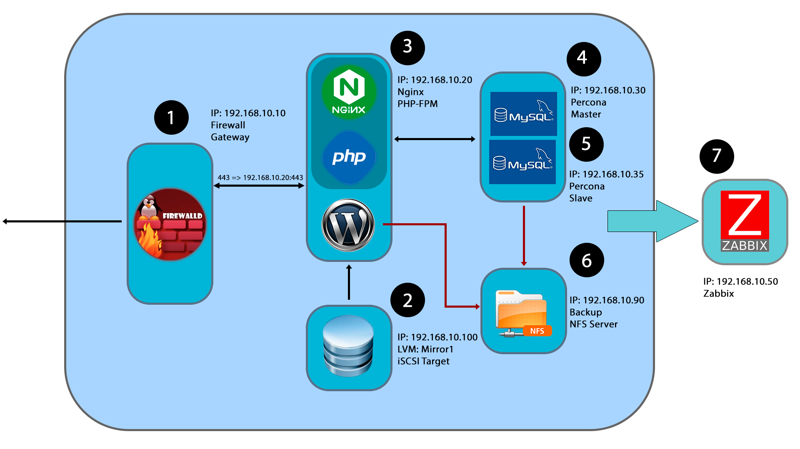

# Проектная работа

## Цель:

Веб проект с развертыванием нескольких виртуальных машин должен отвечать следующим требованиям:
* включен https;
* основная инфраструктура в DMZ зоне;
* файрвалл на входе;
* сбор метрик и настроенный алертинг;
* везде включен selinux.

## Выполнение:

Схема стенда

### Состав проекта

- Всего: 7 хостов. 
- Метод разворачивания: Ansible.
- На хостах включен файрвол (Firewalld):
	- Настроены необходимые службы и порты.
- На хостах включен SELinux:
	- Настроены необходимые контексты.
- Все хосты выходят из локальной сети через хост Router.

### Хосты

Хосты | IP адрес
------| ---------
Router | 192.168.10.10
WEB (Nginx) | 192.168.10.20
MySQL (MASTER) | 192.168.10.30
MySQL (SLAVE) | 192.168.10.35
Monitoring (Zabbix) | 192.168.10.50
Data (iSCSI) | 192.168.10.100
Backup (NFS Server) | 192.168.10.90

Для разворачивания стенда выполняем `vagrant up`. Для разворачивания хостов подготовлен Ansible playbook. В playbook ипортируются роли, каждая роль разворачивает определенную службу.

Параметры для Zabbix:

Хосты | Hostname
------| ---------
Router | router
WEB | nginx
MySQL Master | mysqlmaster
MySQL Slave | mysqlslave
Storage | storage
Backup | backup

### Доступ к сервисам

Сервис | Адрес
------| ---------
Wordpress (Nginx+PHP-FPM) | https://192.168.10.20
Zabbix | http://192.168.10.50/zabbix

